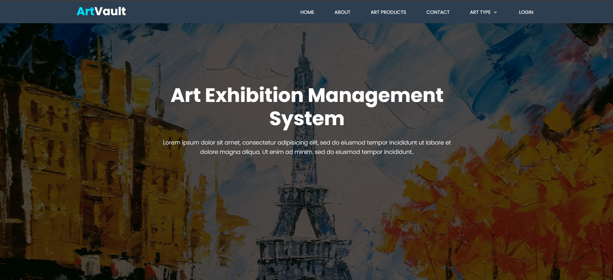

# ArtVault - Art Exhibition Management System 🖼️🎨

This is a full-stack web application built as part of a software engineering practice project. The system helps artists register, submit artworks, and manage exhibitions, while allowing visitors to view, explore, and interact with art in a user-friendly digital environment.

## Table of contents

- [Overview](#overview)
  - [The challenge](#the-challenge)
  - [Screenshots](#screenshots)
  - [Live Demo & Source](#live-demo--source)
- [My process](#my-process)
  - [Built with](#built-with)
- [Author](#author)
- [License](#license)

---

## 🧩 Overview

### The challenge

Users should be able to:

- Register as an artist and submit artwork  
- Browse art by category, medium, or creator  
- View detailed information about art pieces  
- Contact administrators or artists through a form  
- Manage exhibitions through an admin dashboard  
- Paginate through products and filter art types  
- View responsive UI optimized for all screen sizes  
- **Admin Features:** Create, Read, Update, Delete (CRUD) for artworks, types, users

---

### 📸 Screenshots

> Upload screenshots here or embed from a live URL

---

### 🔗 Live Demo & Source

- 📦 Backend + Frontend Code: [GitHub Repository](https://github.com/bayzidalways/Art-Exhibition-Management-System)  
- 🌐 Live Site: [Visit Live Demo](#)

---

## ⚙️ My Process

This project was developed using the MVC architecture with Django, integrating frontend HTML/CSS templates and a MySQL database. It includes fully responsive layouts and user authentication.

---

### 🚀 Built with

- [Python](https://www.python.org/)
- [Django](https://www.djangoproject.com/) - Web Framework  
- [MySQL](https://www.mysql.com/) - Relational Database  
- HTML5, CSS3, Bootstrap  
- JavaScript (Vanilla)  
- Django Templates  
- Responsive Grid and Flexbox  
- Django Admin & Forms  
- Pagination and URL Routing  
- Media/Image Upload Handling

---

## 👨‍🎨 Author

- Website - [MD Bayzid](mdbayzid.netlify.app)  
- GitHub - [@bayzidalways](https://github.com/bayzidalways)  
- LinkedIn - [@MD Bayzid](https://www.linkedin.com/in/md-bayzid-211b67345/)  
- Email - bayzidalways@email.com

---

## 📄 License

This project is part of a university practice course and is for educational use only. For production licensing or collaboration, please contact the author.
